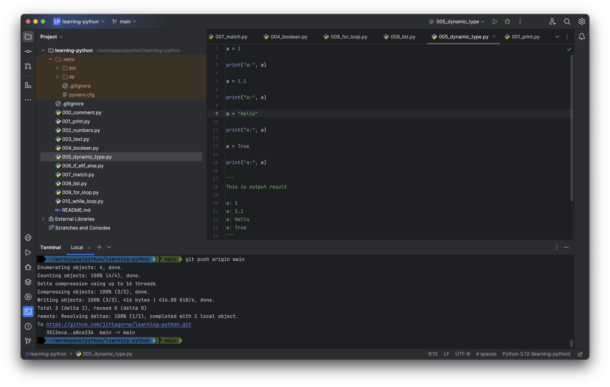

# Learning Python

Documentation
- [https://docs.python.org/3/tutorial/index.html](https://docs.python.org/3/tutorial/index.html)

# How to run

1. Install Python 3

> Download from this website [https://www.python.org/downloads/](https://www.python.org/downloads/)

2. Install PyCharm CE

> Download from this webite [https://www.jetbrains.com/pycharm/download/](https://www.jetbrains.com/pycharm/download/)

  

